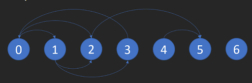

Problem Statement
Last saved: 4:53 PM
There is a directed graph of n nodes with each node labeled from 0 to n - 1. The graph is represented by a 0-indexed 2D integer array graph where graph[i] is an integer array of nodes adjacent to node i, meaning there is an edge from node i to each node in graph[i].

A node is a terminal node if there are no outgoing edges. A node is a safe node if every possible path starting from that node leads to a terminal node (or another safe node).

Return an array containing all the safe nodes of the graph. The answer should be sorted in ascending order.

Input Format

The first line contains an integer n - the number of nodes.
The next n lines each contain n space-separated integers (0 or 1) representing the adjacency matrix of the graph:
graph[i][j] = 1 → there is a directed edge from node i to node j
graph[i][j] = 0 → no edge
Output Format

Print all safe nodes in ascending order, space-separated.

Example 1:

Input:    
7   
0 1 1 0 0 0 0   
0 0 1 1 0 0 0   
0 0 0 0 0 1 0   
1 0 0 0 0 0 0   
0 0 0 0 0 1 0   
0 0 0 0 0 0 0    
0 0 0 0 0 0 0    

Output:   
2 4 5 6     

Explanation:      
The given graph is shown above.
Nodes 5 and 6 are terminal nodes as there are no outgoing edges from either of them.
Every path starting at nodes 2, 4, 5, and 6 all lead to either node 5 or 6.

Constraints:

n == graph.length
1 <= n <= 1e4
n == graph[i].length
0 <= graph[i][j] <= 1
graph[i] is sorted in a strictly increasing order.
The graph may contain self-loops.
The number of edges in the graph will be in the range [1, 4 * 1e4].
Time Complexity (TC)

O(V + E) - using reverse graph + BFS (Kahn’s algorithm) or DFS cycle detection

Space Complexity (SC)

O(V + E) - for adjacency list, reverse graph, and queue/visited arrays