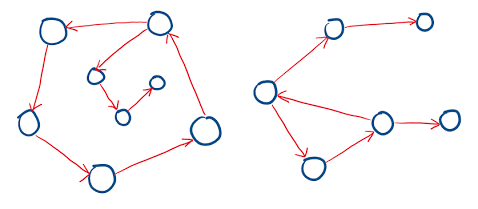

You are given a directed graph with $n$ nodes, labeled from $0$ to $n - 1$. Every node $i$ has exactly one outgoing edge pointing to edges[i]

Edge Score Definition:The edge score of a node u is the sum of all node labels (indices) that point directly to u.

If nodes 1 and 3 point to node 2, the edge score of node 2 is 1 + 3 = 4.

If no node points to node u, its edge score is 0.

Goal:Return the node with the highest edge score. If multiple nodes share the maximum edge score, return the node with the smallest index.

Key Intuition & Approach:
1.Create a score array scores of size n, initialized to 0.
2.Iterate through edges: for each node i pointing to edges[i], add i to scores[edges[i]].
3.Find the node index with the maximum score.

Walkthrough Example
Given edges = [1, 0, 0, 0, 0, 7, 7, 5]:
Node 0 points to 1 → Add 0 to scores[1]
Node 1 points to 0 → Add 1 to scores[0]
Node 2 points to 0 → Add 2 to scores[0]
Node 3 points to 0 → Add 3 to scores[0]
Node 4 points to 0 → Add 4 to scores[0]
Node 5 points to 7 → Add 5 to scores[7]
Node 6 points to 7 → Add 6 to scores[7]
Node 7 points to 5 → Add 7 to scores[5]
Final Scores:
scores[0] = 1 + 2 + 3 + 4 = 10
scores[1] = 0
scores[5] = 7
scores[7] = 5 + 6 = 11
The maximum score is 11 at Node 7.

Complexity Analysis:

Time Complexity: O(n)
A single pass to compute edge scores, and a second pass to find the maximum.
Space Complexity: O(n)
An array of size $n$ stores the accumulated scores.